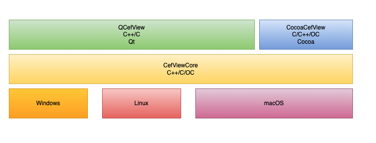

# CefViewCore

CefViewCore is the core abstraction layer of CefView projects. The QCefView and CocoaCefView are both based on the CefViewCore. In ther future there would be more CefView projects with different languange bindings or platform supports.

CefViewCore was written in only C++ (minor Objective-C code is used in CefViewWing application for macOS) so that it could be a common base layer for the other high level projects.

 
<em>CefView Stack</em>

 ## Build status
| triplets  | status  |
|---|---|
| Windows-x64 |  |
|  macOS-x64  |  |
|  Linux-x64  |  |